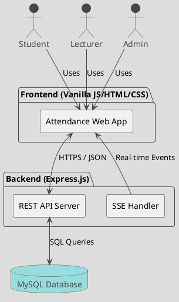
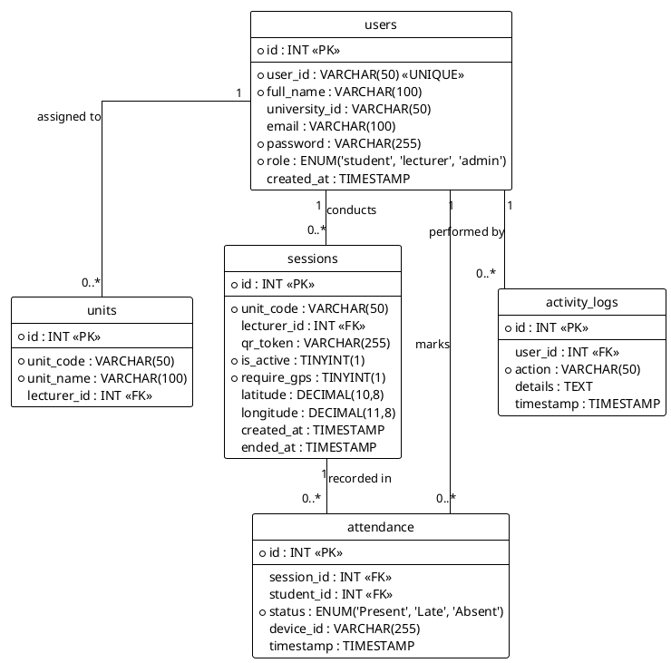
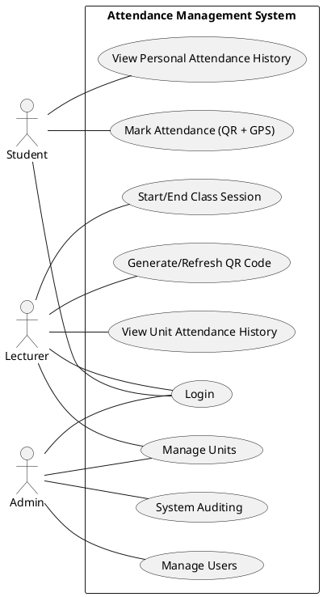
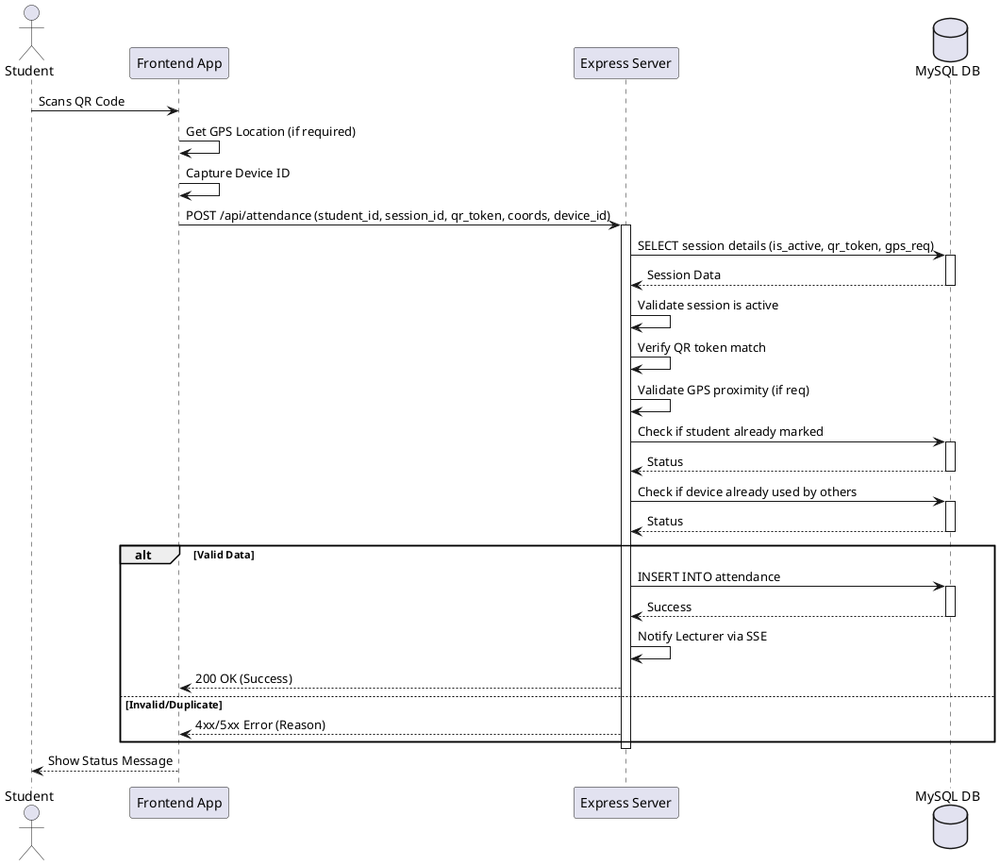
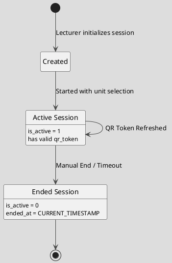
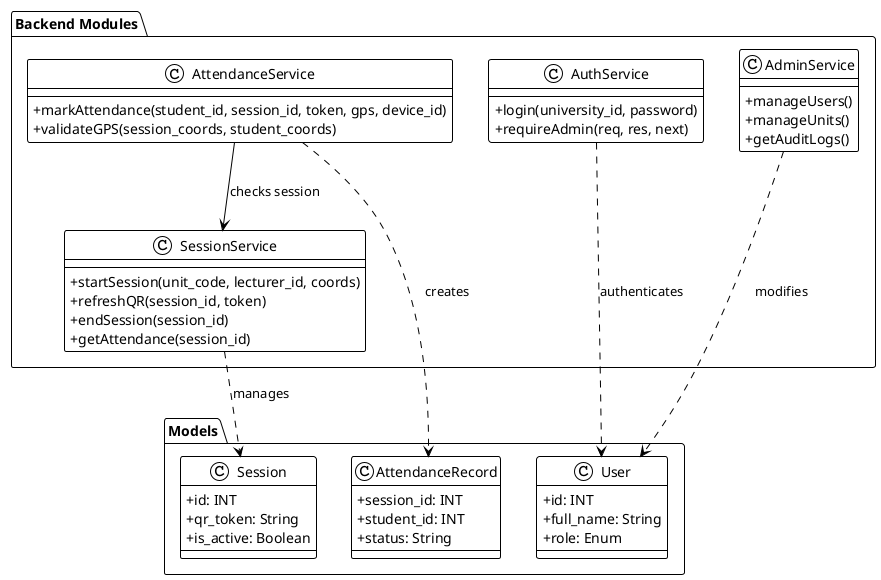
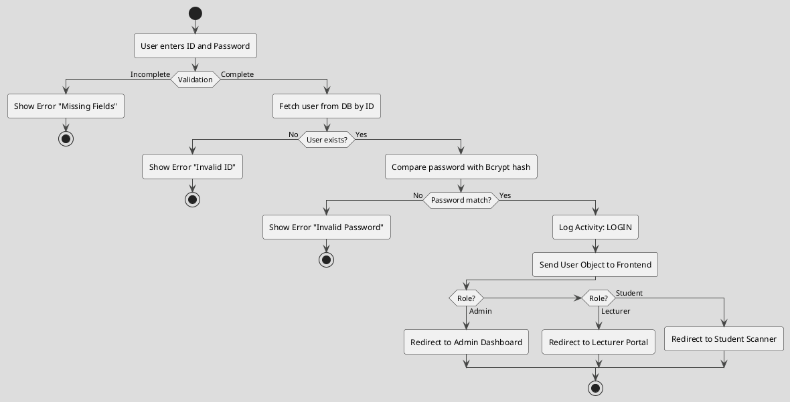
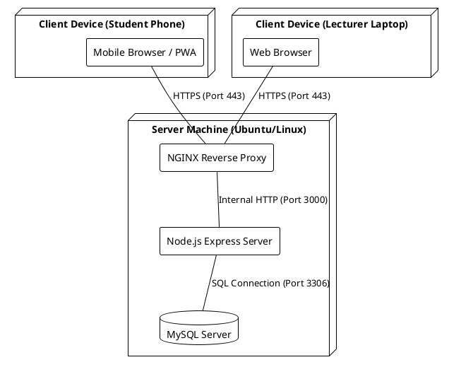
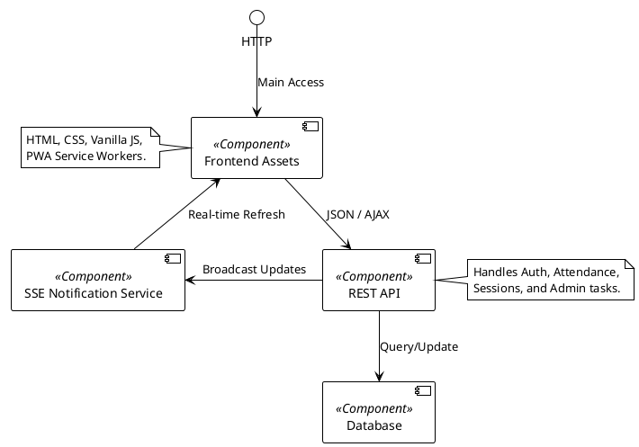

# System UML Diagrams


This document contains UML diagrams for the Attendance Management System, represented in [PlantUML](https://plantuml.com/) format.

## 1. System Architecture Diagram

Shows the high-level components and their interactions.



## 2. Entity Relationship Diagram (ERD)

Visualizes the database schema and table relationships.



## 3. Use Case Diagram

Describes system functionality from the perspective of different users.



## 4. Sequence Diagram: Marking Attendance

Illustrates the step-by-step process of a student marking attendance.



## 5. State Machine Diagram: Session Lifecycle

Shows the states of a class session based on the `is_active` flag.



## 6. Class Diagram

While the backend is functional/procedural Node.js, this diagram represents the logical modules and data structures.



## 7. Activity Diagram: User Login Flow

Describes the logic for user authentication and role-based redirection.



## 8. Deployment Diagram

Shows the physical deployment of the system over a Local Area Network (LAN).



## 9. Component Diagram

Modular view of the system's software components.



```
