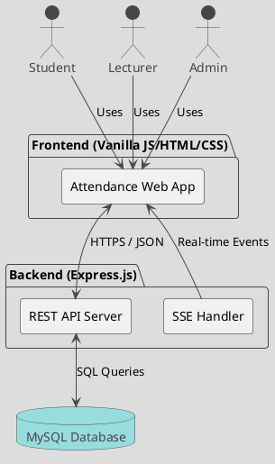
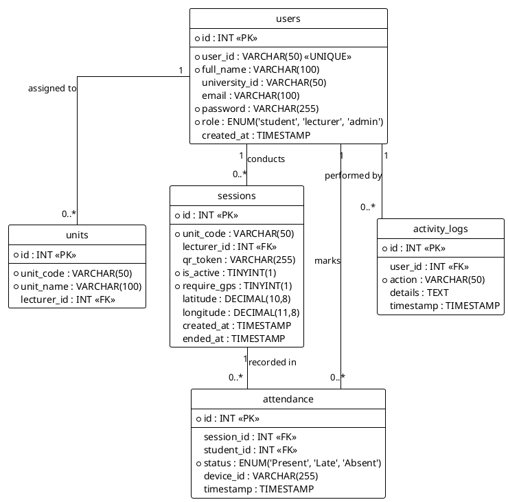
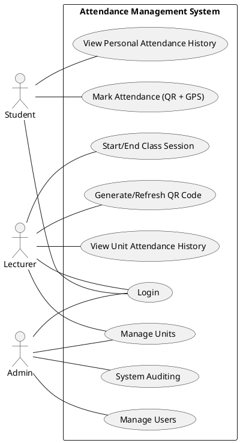
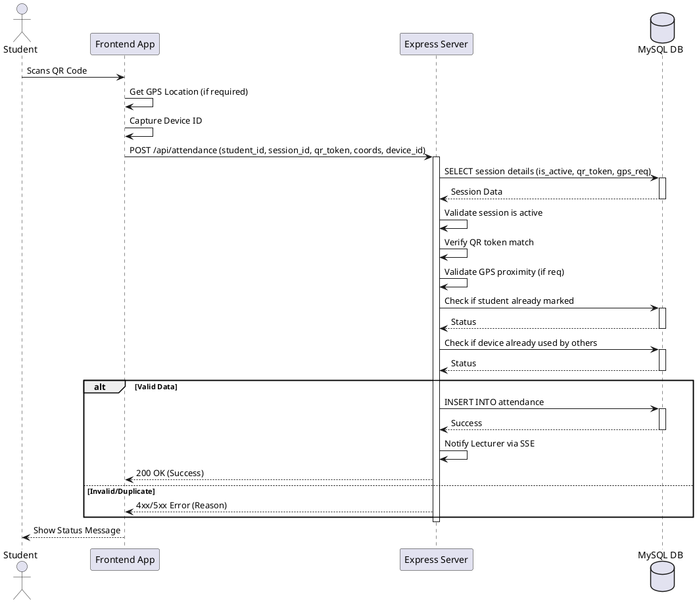
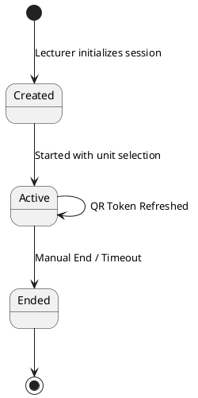

# System UML Diagrams

This document contains UML diagrams for the Attendance Management System, represented in [PlantUML](https://plantuml.com/) format.

## 1. System Architecture Diagram

Shows the high-level components and their interactions.

## 2. Entity Relationship Diagram (ERD)

Visualizes the database schema and table relationships.

## 3. Use Case Diagram

Describes system functionality from the perspective of different users.

## 4. Sequence Diagram: Marking Attendance

Illustrates the step-by-step process of a student marking attendance.

## 5. State Machine Diagram: Session Lifecycle

Shows the states of a class session.

